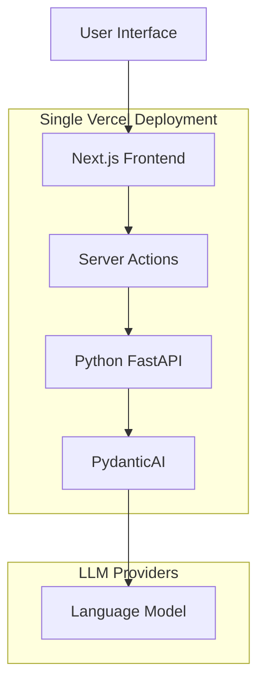

# ✨ One Deployment, Two Powers: Next.js Meets Python AI

In AI development, many teams choose either one tech stack, Python or JavaScript. But with so much innovation happening in both ecosystems, why not take advantage of the best of both?

Even when providers make SDKs available in both languages, it's often the case that they don't have feature parity, with features implemented and more feature-rich in the Python ecosystem.

What if you could use the latest frameworks and libraries to build best-in-class applications? Could we use PydanticAI and Next.js in the same repository with a single deployment?

I've open-sourced a project that demonstrates exactly this: shipping a Next.js frontend and Python AI backend together in one codebase, one deployment, without the complexity of microservices.

🔁 This project shows how you can ship a Next.js frontend and a Python AI backend together in one codebase, one deploy, no microservices, no CORS config.


## 🤖 Why this matters

Developers often love the flexibility of Python's AI stack (PydanticAI, LangChain, OpenAI), where most of the innovation happens, but want the ergonomics of a modern UI (Next.js, Server Actions, Tailwind).

With this setup:

✅ Write Python AI endpoints once using FastAPI + PydanticAI  
✅ Call them like functions in Next.js via Server Actions  
✅ Switch between OpenAI, OpenRouter, or Ollama with a single env change  
✅ Deploy everything on Vercel without Docker or Kubernetes

## 🧠 Under the Hood

We combined:

- **FastAPI + PydanticAI** for strongly-typed LLM agents
- **Next.js 15 with Server Actions** for clean UI and DX
- **A smart bridge** that makes Python endpoints feel like native TypeScript functions

All running in a single Vercel deployment, with zero glue code or YAML acrobatics.

## 🗺️ Use cases

- Build LLM UIs without rewriting your AI stack in JS
- Let designers prototype with Storybook while you tune models in Python
- Share one deployable app that just works

---

## 🔧 Architecture



## 🧩 How It Works

### 1. Python AI Service

The heart of the AI logic lives in [`api/index.py`](api/index.py) - a FastAPI app with PydanticAI agents that handle translation requests. The magic? It automatically switches between local Ollama and cloud providers based on your env config.

Key features:

- **Provider flexibility**: `model=ollama:llama3.2` or `model=openai:gpt-4o`
- **Type safety**: Full Pydantic validation on inputs/outputs
- **Error handling**: Proper logging and HTTP status codes

### 2. Next.js Bridge

Server Actions in [`src/app/actions.ts`](src/app/actions.ts) make Python endpoints feel like native TypeScript functions. No fetch boilerplate, no manual error handling - just clean async functions.

The [`src/lib/utils.ts`](src/lib/utils.ts) helper automatically detects if you're running locally or on Vercel and routes requests accordingly.

### 3. Smart Frontend

The UI in [`src/components/app.tsx`](src/components/app.tsx) uses debounced translation with toast notifications and loading states. Users get instant feedback while the Python backend processes their requests.

### 4. Unified Deployment

Vercel's [`vercel.json`](vercel.json) configuration handles both Node.js and Python runtimes in a single deployment. No Docker, no orchestration - just push and deploy.

---

## 🛡️ Provider Flexibility

Switch AI providers with one line in your `.env.local`:

```bash
# Local Ollama
model=ollama:llama3.2

# OpenAI
model=openai:gpt-4o
openai_api_key=your_key_here

# Works with any OpenAI-compatible API
```

The Python backend automatically configures the right provider and model.

---

## 📍 Getting Started

```bash
git clone https://github.com/jagreehal/nextjs-pydantic-ai-vercel-demo.git
cd nextjs-pydantic-ai-vercel-demo
pnpm install
pip install -r requirements.txt
source .venv/bin/activate  # Activate Python virtual environment
cp .env.example .env.local
```

Configure your AI provider:

```bash
echo "model=ollama:llama3.2" >> .env.local
# or
echo "model=openai:gpt-4o" >> .env.local
echo "openai_api_key=sk-..." >> .env.local
```

Start everything:

```bash
pnpm dev
```

Visit [http://localhost:5002](http://localhost:5002) and start translating!

---

## 🎯 Results & Takeaways

- **Unified codebase**: No separate repos or microservices
- **Developer experience**: Server Actions make Python calls feel native
- **Deployment simplicity**: One command, both runtimes deployed
- **Ecosystem interoperability**: Best of both Python AI and JavaScript UI worlds

---

## 💡 Next Steps

Expand with more endpoints, chain neural models, integrate databases, or stream responses. Use this as a blueprint for full-stack AI-powered web apps.

🚀 **Live Demo & Code**: [github.com/jagreehal/nextjs-pydantic-ai-vercel-demo](https://github.com/jagreehal/nextjs-pydantic-ai-vercel-demo)

#nextjs #python
